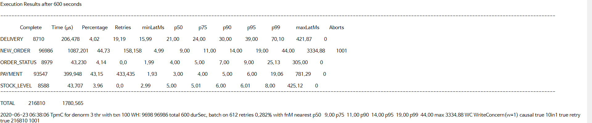
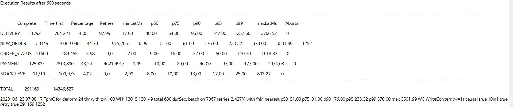
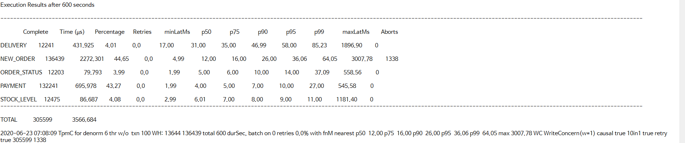

# Benchmark Results

All results were tested on the environment described in [README.md](https://github.com/hyunjinjeong/py-tpcc/blob/master/README.md#environment).

## 1. Transaction, Normalize

- 1 Client

- 3 Clients

- 6 Clients

- 12 Clients

- 24 Clients

- 48 Clients

## 2. Transaction, Denormalize

- 1 Client

- 3 Clients

- 6 Clients

- 12 Clients

- 24 Clients

- 48 Clients

## 3. No-Transaction, Normalize

- 1 Client

- 3 Clients

- 6 Clients

- 12 Clients

- 24 Clients

- 48 Clients

## 4. No-Transaction, Denormalize

- 1 Client

- 3 Clients

- 6 Clients

- 12 Clients

- 24 Clients

- 48 Clients

